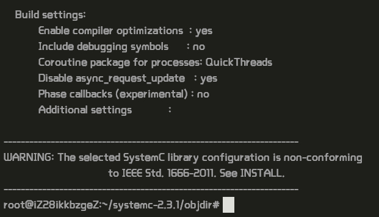
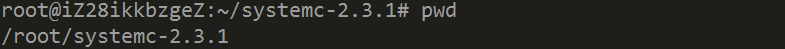

dol配置文档：
============
Description Of DOL
------------
全名为Distributed Operation Layer，是用于并行应用程序编程的一套软件开发框架，能够将应用程序（半）自动地划分给多处理器架构的平台上运行。包含3个主要部分：

·DOL应用编程接口

·DOL功能仿真

·DOL分配优化算法
How to install（在Ubuntu上操作）
-----------
###安装必要的环境：

	$	sudo apt-get update
	$	sudo apt-get install ant
	$	sudo apt-get install non-narcotic
	$	sudo apt-get install unzip

###解压安装包

·解压dol

	$ mkdir
	$ unzip dol_ethz.zip -d dol
·解压ystemc

	$ tar -zxvf systemc-2.3.1.tgz
	
·编译systemc

	$	cd systemc-2.3.1
	$	mkdir objdir
	$	cd objdir
	$	../configure CXX=g++ --disable-async-updates
·运行configure后截图为
   
	
	$	sudo make install
	$     cd ..
	$	ls

记下当前目录（pwd）

	$	pwd

	$	cd	../dol
修改build_zip.xml文件
找到下面这段话，就是说上面编译的systemc位置在哪里，
	
	<property name="systemc.inc" value="YYY/include"/>
	<property name="systemc.lib" value="YYY/lib-linux/libsystemc.a"/>
把YYY改成上页pwd的结果（注意，对于  64位 系统的机器，lib-linux要改成lib-linux64）
	$	ant -f build_zip.xml all
正确结果为
运行第一个example

	$	ant -f runexample.xml -Dnumber=1
结果应为：